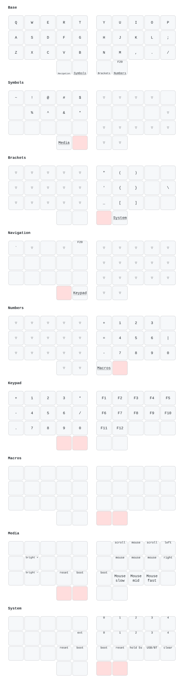

# gil

Custom configuration for the [Urchin keyboard].

## Keymap

The keymap is aligned with the Aurora Sweep's QMK keymap (`sz` in
[soarez/qmk_firmware]): layers 0–7 are identical, and layer 8 holds each
board's own hardware controls. [`docs/layout.html`](./docs/layout.html)
compares the two key by key.

## Features

* Local build — no need for GitHub actions!
* Custom artwork for the nice!view art widget in the right half
* Automated flashing
* Keymap visualization with [keymap-drawer]
* Text macros typed from text set at build time, kept out of git

## Getting started

1. Configure your keymap in `config/gil.keymap`.
2. Configure your choice of artwork in `art/config.json`.
3. Set the text for each text macro in `macros/<name>.txt` or
   `$KB_MACRO_<NAME>` (see `macro_text.py`).
4. Build the firmware running `./build.sh`.
5. Flash the firmware running `./flash.sh`.
6. Redraw the keymap running `./draw.sh`, and the comparison with the Sweep
   running `python3 docs/layout_page.py`.

[Urchin keyboard]: https://github.com/duckyb/urchin
[keymap-drawer]: https://github.com/caksoylar/keymap-drawer
[soarez/qmk_firmware]: https://github.com/soarez/qmk_firmware/tree/sz/keyboards/splitkb/aurora/sweep/keymaps/sz
